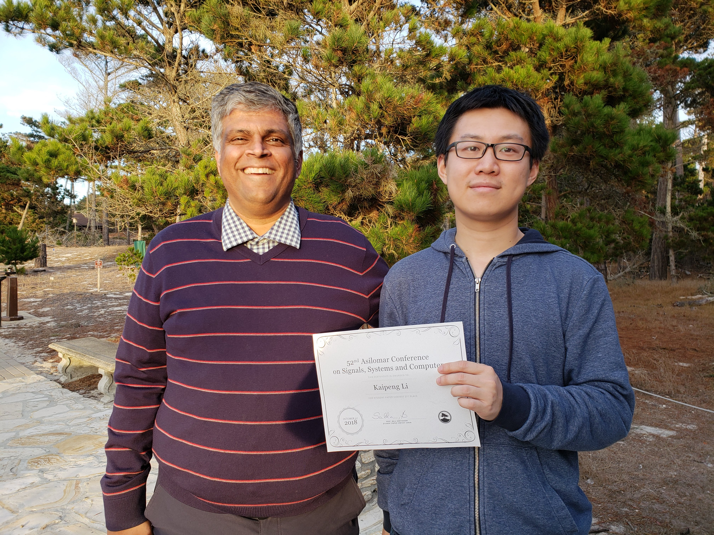

## BRICK: Breaking the I/O and Computation Bottlenecks in Massive MIMO Base Stations

Massive multi-antenna (MIMO) wireless systems, in which the base-station is equipped with hundreds or thousands of antenna elements, will enable unprecedented data rates, cell coverage, and transmission reliability compared to that of existing cellular communication systems. The presence of hundreds or thousands of radio-frequency (RF) transceivers and antennas, however, results in excessively high interconnect and chip input/output (I/O) data rates, as well as excessively high baseband processing complexity, which results bottlenecks that prevent a straightforward deployment of this technology in practical systems. 

### Main Contributions:

This project will develop new technologies that rely on **decentralized signal processing at the base-station** in order to avoid these bottlenecks, which leads to feasible and scalable solutions that enable base-station designs with thousands of antenna elements without sacrificing performance or reliability. In addition to enabling massive MIMO in practice, the project will advance future cellular networks through collaboration with the telecommunications industry, with the [Argos massive MIMO testbed](http://argos.rice.edu/), and other network research testbeds. The project's broader impact on education and outreach will include multiple components, including 
* Training a diverse group of students as part of a collaborative, multi-institutional research team in the areas of communication theory and circuit design, 
* Integrating outcomes of the work into undergraduate and graduate courses, and 
* Making research outcomes broadly available through public-domain software packages and open-education resources via OpenStax courseware.

The project develops novel decentralized algorithms as well as very-large scale integration (VLSI) and general-purpose computing on graphics processing units (GPGPU) architectures based on antenna clustering and parallelization, for the uplink (users communicate to base-station) and the downlink (base-station communicates to users). The main idea of decentralized baseband processing is to divide the signal-processing workload at the base-station into multiple computing fabrics that are each connected to only a subset of RF transceivers and antennas. To reduce the chip-interconnect and computation bottlenecks the project investigates (i) optimization-based algorithms that exchange consensus information among the antenna clusters and (ii) message-passing-based algorithms that avoid such consensus exchange altogether. The most promising algorithm solutions will be implemented on field-programmable gate array and GPGPU clusters to assess the efficacy and limits of the developed solutions with real-world performance, hardware, and bandwidth constraints. The results of this analysis will provide guidelines that enable optimal massive MIMO base-station designs that use decentralized baseband processing.

## News

* May 2019: [Kaipeng Li](https://www.linkedin.com/pub/kaipeng-li/76/517/637) successfully defended his Ph.D. Dissertation and graduated from Rice University in May on [Decentralized Baseband Processing for Massive MU-MIMO Systems](https://scholarship.rice.edu/handle/1911/105428). We wish him good luck at Amazon in Seattle, WA!

* Dec. 2018: Charles Jeon successfully defended his Ph.D. Thesis on massive MIMO data detection and feedforward architectures for decentralized baseband processing. We wish him good luck at Intel Labs in Hillsboro, OR!

* Nov. 2018: [Kaipeng Li wins 2nd place in the student paper contest at Asilomar 2018](https://engineering.rice.edu/news/more-antennas-means-more-connectivity-mobile-devices)

## Publications

* [Li, Kaipeng and Sharan, Rishi R. and Chen, Yujun and Goldstein, Tom and Cavallaro, Joseph R. and Studer, Christoph. "Decentralized Baseband Processing for Massive MU-MIMO Systems," IEEE Journal on Emerging and Selected Topics in Circuits and Systems, v.7, 2017. doi:10.1109/JETCAS.2017.2775151](https://arxiv.org/abs/1702.04458)

* [Jacobsson, Sven and Durisi, Giuseppe and Coldrey, Mikael and Goldstein, Tom and Studer, Christoph. "Quantized Precoding for Massive MU-MIMO," IEEE Transactions on Communications, v.65, 2017. doi:10.1109/TCOMM.2017.2723000](https://arxiv.org/abs/1610.07564)

* [Jeon, Charles and Li, Kaipeng and Cavallaro, Joseph R. and Studer, Christoph. "On the achievable rates of decentralized equalization in massive MU-MIMO systems," IEEE International Symposium on Information Theory (ISIT), 2017. doi:10.1109/ISIT.2017.8006699](https://arxiv.org/abs/1705.02976)

* [Jacobsson, Sven and Durisi, Giuseppe and Coldrey, Mikael and Gustavsson, Ulf and Studer, Christoph. "Throughput Analysis of Massive MIMO Uplink With Low-Resolution ADCs," IEEE Transactions on Wireless Communications, v.16, 2017. doi:10.1109/TWC.2017.2691318](https://arxiv.org/pdf/1602.01139.pdf)

* [Li, Kaipeng and Jeon, Charles and Cavallaro, Joseph R. and Studer, Christoph. (2017). Decentralized equalization for massive MU-MIMO on FPGA.  2017 51st Asilomar Conference on Signals, Systems, and Computers.  pp. 1532 to 1536. doi:10.1109/ACSSC.2017.8335613 ](https://doi.org/10.1109/ACSSC.2017.8335613)

* [Tarver, Chance and Abdelaziz, Mahmoud and Anttila, Lauri and Valkama, Mikko and Cavallaro, Joseph R.. (2018). Low-complexity, Multi Sub-band Digital Predistortion: Novel Algorithms and SDR Verification.  Journal of Signal Processing Systems. 90 (10) pp. 1495 to 1505.   doi:10.1007/s11265-017-1303-1](https://doi.org/10.1007/s11265-017-1303-1)

* [Tarver, Chance and Cavallaro, Joseph R.. (2017). Digital predistortion with low-precision ADCs.  2017 51st Asilomar Conference on Signals, Systems, and Computers. pp. 462 to 465.  doi:10.1109/ACSSC.2017.8335381 ](https://doi.org/10.1109/ACSSC.2017.8335381)

* [Wu, Michael and Yin, Bei and Li, Kaipeng and Dick, Chris and Cavallaro, Joseph R. and Studer, Christoph. (2018). Implicit vs. Explicit Approximate Matrix Inversion for Wideband Massive MU-MIMO Data Detection.  Journal of Signal Processing Systems. 90 (10) pp. 1311 to 1328. doi:10.1007/s11265-017-1313-z  ](https://doi.org/10.1007/s11265-017-1313-z)

* [C. Jeon, K. Li, J. R. Cavallaro, and C. Studer, "Decentralized Equalization with Feedforward Architectures for Massive MUMIMO," IEEE Transactions on Signal Processing, (Submitted August 2018). Pre-print
https://arxiv.org/abs/1808.04473. Volume: 67, Issue: 17, pp. 4418 - 4432,  (September 2019). doi:10.1109/TSP.2019.2928947](https://doi.org/10.1109/TSP.2019.2928947)

* [K. Li, C. Jeon, J. R. Cavallaro, and C. Studer, "Feedforward Architectures for Decentralized Precoding in Massive MU-MIMO Systems," 2018 IEEE 52th Asilomar Conference on Signals, Systems and Computers, Pacific Grove, CA, (October 2018) (Accepted July 2018). doi:10.1109/ACSSC.2018.8645086](https://doi.org/10.1109/ACSSC.2018.8645086)

* [A. Sabharwal, E. Knightly, J. R. Cavallaro, L. Zhong Z. M. Mao, W. W. Li, X. Chen, "RENEW: Programmable and Observable Massive MIMO Networks," 2018 IEEE 52nd Asilomar Conference on Signals, Systems, and Computers, Pacific Grove, CA (October 2018) (Accepted July 2018). doi:10.1109/ACSSC.2018.8645391](https://doi.org/10.1109/ACSSC.2018.8645391)

* [Kaipeng Li, Oscar Castaneda, Charles Jeon, Joseph R. Cavallaro, and Christoph Studer, Decentralized Coordinate-Descent Data Detection and Precoding for Massive MU-MIMO, 2019 IEEE International Symposium on Circuits and Systems (ISCAS) (May 2019). doi:10.1109/ISCAS.2019.8702740](https://doi.org/10.1109/ISCAS.2019.8702740)

* Chance Tarver, Alexios Balatsoukas-Stimming, and Joseph R. Cavallaro, "Design and Implementation of a Neural Network Based Predistorter for Enhanced Mobile Broadband" 2019 IEEE International Workshop on Signal Processing Systems (SiPS), (Accepted July 31, 2019)

* Kaipeng Li, James McNaney, Oscar Castañeda, Chance Tarver, Charles Jeon, Joseph R. Cavallaro, Christoph Studer, "Design Trade-offs for Decentralized Baseband Processing in Massive MU-MIMO Systems," 2019 IEEE 53nd Asilomar Conference on Signals, Systems, and Computers, Pacific Grove, CA, (Accepted August 1, 2019)

* Chance Tarver, Liwen Jiang, Aryan Sefidi and Joseph Cavallaro, "Neural Network DPD via Backpropagation through a Neural Network Model of the PA," 2019 IEEE 53nd Asilomar Conference on Signals, Systems, and Computers, Pacific Grove, CA, (Accepted August 1, 2019)

### Preliminary Work 
* [Li, Kaipeng and Skaran, Riski and Chen, Yujun and Cavallaro, Joseph R. and Goldstein, Tom and Studer, Christoph. "Decentralized beamforming for massive MU-MIMO on a GPU cluster," IEEE Global Conference on Signal and Information Processing (GlobalSIP), 2016. doi:10.1109/GlobalSIP.2016.7905910](http://vip.ece.cornell.edu/papers/16GlobalSIP_decent.pdf)

* [Li, Kaipeng and Chen, Yujun and Sharan, Rishi and Goldstein, Tom and Cavallaro, Joseph R. and Studer, Christoph. "Decentralized data detection for massive MU-MIMO on a Xeon Phi cluster," Asilomar Conference on Signals, System, and Computers, 2016. doi:10.1109/ACSSC.2016.7869083](https://ieeexplore.ieee.org/document/7869083)

## Software

* [MATLAB simulation framework for decentralized feedforward precoding](https://github.com/VIP-Group/DecentralizedFeedforwardPrecoder)

* [MATLAB simulation framework for decentralized baseband processing with consensus-sharing algorithms for the uplink and downlink](https://github.com/VIP-Group/DBP)

## People
### PIs:
* [**Prof. Joe Cavallaro**](http://cavallaro.rice.edu/) at Rice University.
* [**Prof. Christoph Studer**](http://vip.ece.cornell.edu) at Cornell University.

### Graduate Students:
* [**Kaipeng Li**](http://kl33.blogs.rice.edu/) at Rice University.
* [**Chance Tarver**](https://www.chancetarver.com) at Rice University.

### Undergraduate Students:
* [**James McNaney**](https://www.linkedin.com/in/james-mcnaney-4928b4165/) REU student 2019 at Rice University

### Former Students:
* [**Charles Jeon**](http://www.csl.cornell.edu/~jeon/) at Cornell University.

## Contact Information
Email us at nsfbrick@gmail.com
